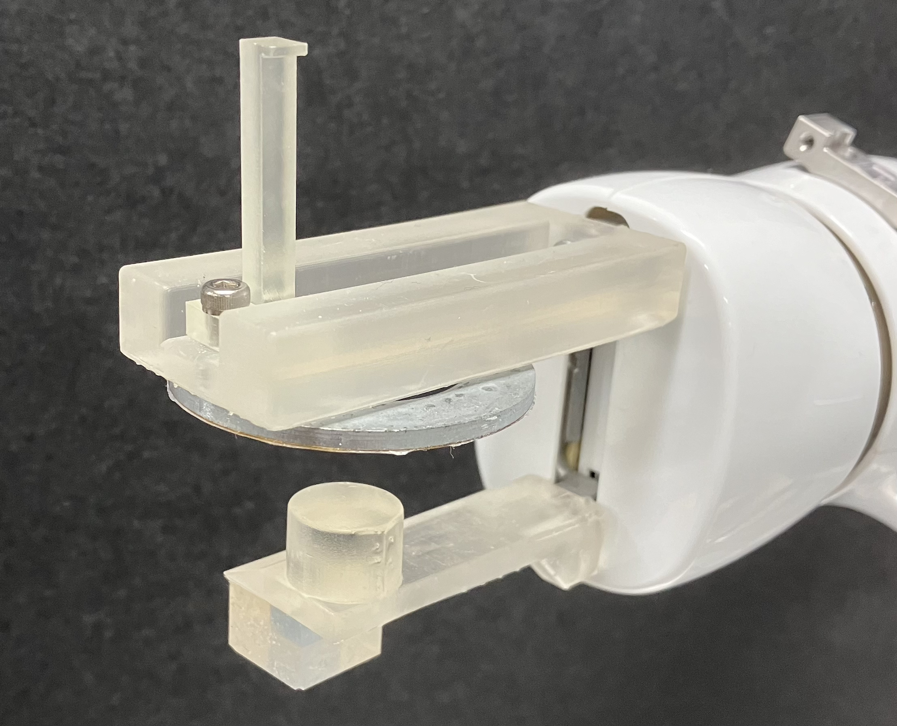

# CAD Files

This folder contains CAD files for the components of the ARE system.

## Contents

### COBOTTA End Effector Files
- `COBOTTA_end_effector_assembly.stl`: Complete assembled model of the robotic arm's multifunctional end effector
- `COBOTTA_end_effector_claw.stl`: Model of the claw component for drawer manipulation
- `COBOTTA_end_effector_lower.stl`: Model of the lower part of the end effector
- `COBOTTA_end_effector_upper.stl`: Model of the upper part of the end effector

## Component Descriptions

### COBOTTA End Effector
The end effector consists of three main 3D-printed parts:
1. Claw (`COBOTTA_end_effector_claw.stl`): Used for opening and closing drawers

2. Upper part (`COBOTTA_end_effector_upper.stl`): Designed with an attachment point for a metal plate (not included in CAD files)

3. Lower part (`COBOTTA_end_effector_lower.stl`): Designed with an attachment point for a soft gel pad (not included in CAD files)

The complete assembled model (`COBOTTA_end_effector_assembly.stl`) shows how these components fit together.

Note: The metal plate and soft gel pad are separate components that need to be sourced and attached separately. They are not included in the CAD files.

## Assembly Instructions

To assemble the COBOTTA end effector:
1. Attach the claw component (`COBOTTA_end_effector_claw.stl`) to the upper part (`COBOTTA_end_effector_upper.stl`)
2. Separately source and attach the metal plate to the designated area on the upper part
3. Separately source and attach the soft gel pad to the designated area on the lower part (`COBOTTA_end_effector_lower.stl`)
4. Connect the upper part (with claw and metal plate) to the COBOTTA arm
5. Connect the lower part (with soft gel pad) to the COBOTTA arm

