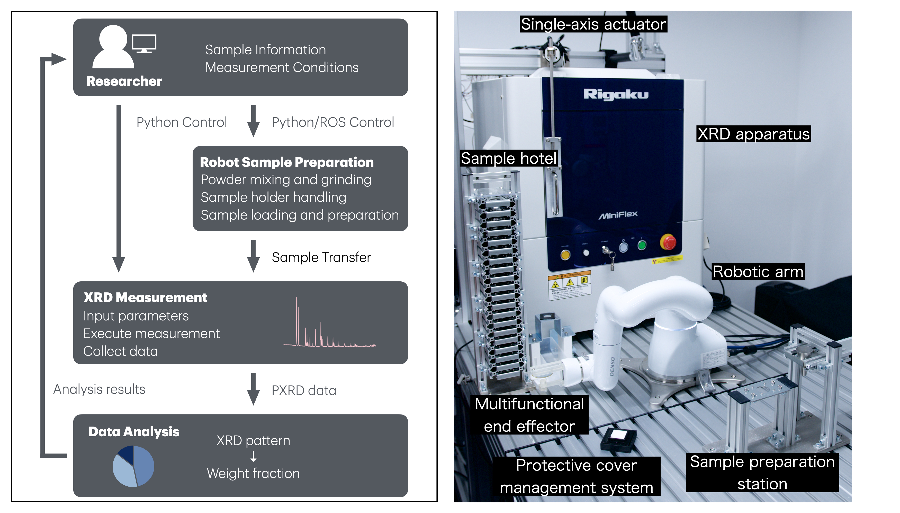

# Autonomous robotic experimentation system for powder X-ray diffraction

This repository contains supplementary materials for our paper "Autonomous robotic experimentation system for powder X-ray diffraction".



## Repository Contents

This repository includes the following:

1. **Rietveld Analysis Results**: Detailed results from our quantitative XRD analysis using the BBO-Rietveld method.

2. **BBO-Rietveld Script**: Basic implementation of our BBO-Rietveld method for automated XRD data analysis.

    The detailed implementation of the BBO-Rietveld method can be found in a separate repository: https://github.com/quantumbeam/BBO-Rietveld

    For a comprehensive understanding of the BBO-Rietveld method and its full implementation, please refer to the linked repository.

3. **CAD Files**: 3D models of the custom-designed end effector used in our robotic system.

## Citation

If you use our data, methods, or findings in your research, please cite our paper:

```bibtex
@article{YotsumotoDigitalDiscovery2024,
  author={Yotsumoto, Yuto and Nakajima, Yusaku and Takamoto, Ryusei and Takeichi, Yasuo and Ono, Kanta},
  title={Autonomous robotic experimentation system for powder {X-ray} diffraction},
  journal={Digital Discovery},
  year={2024},
  volume={3},
  issue={12},
  pages={2523-2532},
  publisher={RSC},
  doi={10.1039/D4DD00190G},
  url={https://doi.org/10.1039/D4DD00190G}
}
```

## License

This project is licensed under the MIT License - see the [LICENSE](LICENSE) file for details.